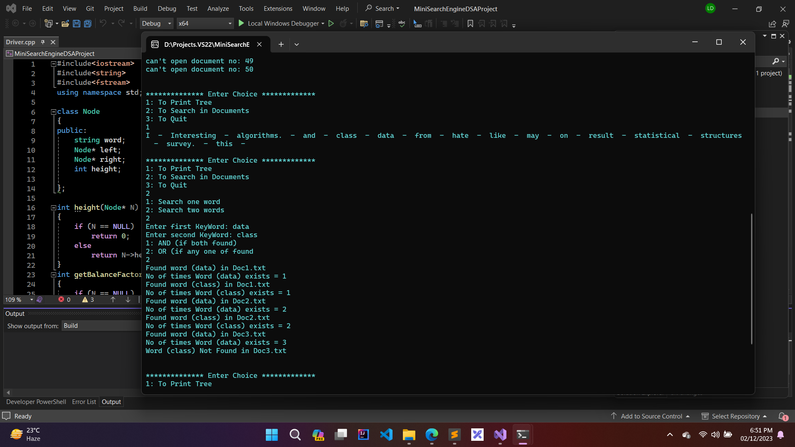
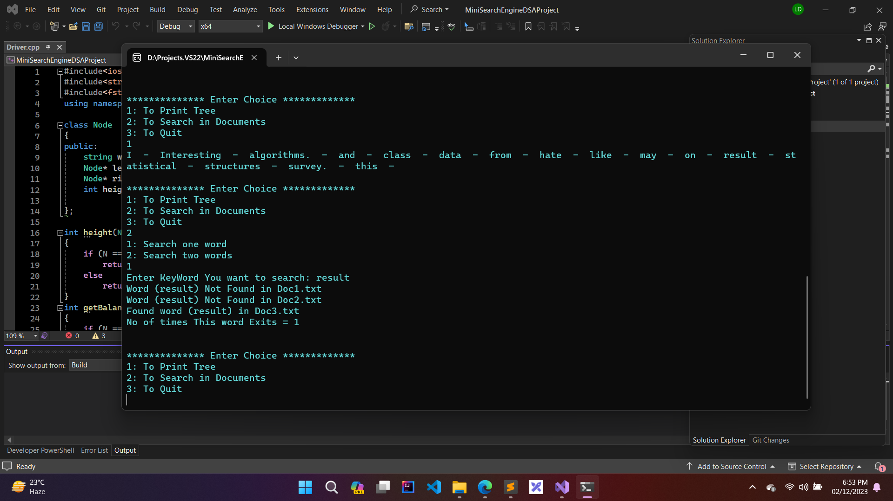

# MiniSearchEngineDSA
Mini Search Engine using AVL in DSA project

## Functionalities
- Can print data uploaded to AVL tree 
- Can search one or two words from documents
- It will also print the no of times the word exists

## Naming Documents
 All documents should be of same Name and numbered like Doc1,Doc2,Doc3... Doc50

## Screenshots

